<p align="center">
  
</p>

[](https://github.com/jonathansearch)

<p align="center">
  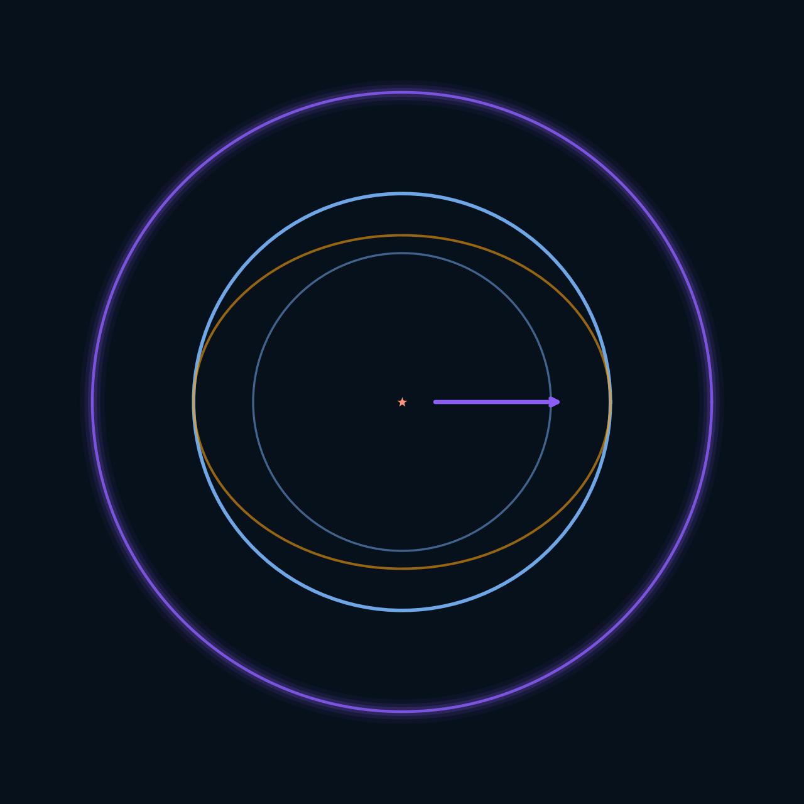
</p>

<h1 align="center">scientist-research — Black holes, Alcubierre &amp; the Topological Coherence Law</h1>

<p align="center">
  <a href="LICENSE"></a>
  
  
  
</p>

> **Author**: Jonathan Evina · ORCID 0009-0000-4092-5313 · DOI 10.17605/OSF.IO/6JZMB
> **Intellectual property**: JOHNKING0 & Jonathan Evina
> **Fundamental law**: LCT (R = P_sig, ΔW = η·φ·P_sig·C) — **frozen**
> **Status**: ongoing research — honest results (validated + documented limits)

An illustrated science-outreach website linking **black hole collapse**, the
**Alcubierre warp bubble** and the **Topological Coherence Law (LCT)**. Built to
explain complicated concepts with figures, and to answer skeptics with
verifiable evidence.

▶️ **Open the science site (live rendering)**: https://evinajonathan13-max.github.io/scientist-research-/
💬 Site source code: [`index.html`](index.html) (self-contained web page, 13 embedded figures)

---

## In one sentence

Three radically different stars collapse toward the **same invariant
topological kernel** (P_sig ≈ 1.80, CV = 1.6%); the von Neumann entropy remains
**invariant** (CV = 0.0%) on physical QPU under energy change — and this
mechanism, reproduced in a **controlled** way, becomes the wall of a warp
bubble stabilized by the Λ_LCT ∝ ∇P_sig term.

## The concepts (with figures)

### 1. The open problem
Gravitational collapse predicts a singularity. But where does the *form* of
the information go?

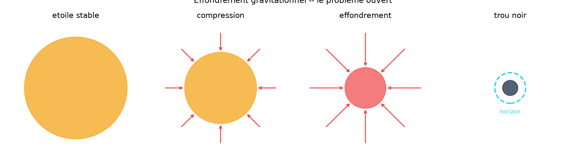

### 2. Black hole vs warp bubble
The black hole collapses (uncontrolled → singularity). The warp bubble applies
a *controlled* dissociation (→ universal kernel, no singularity).

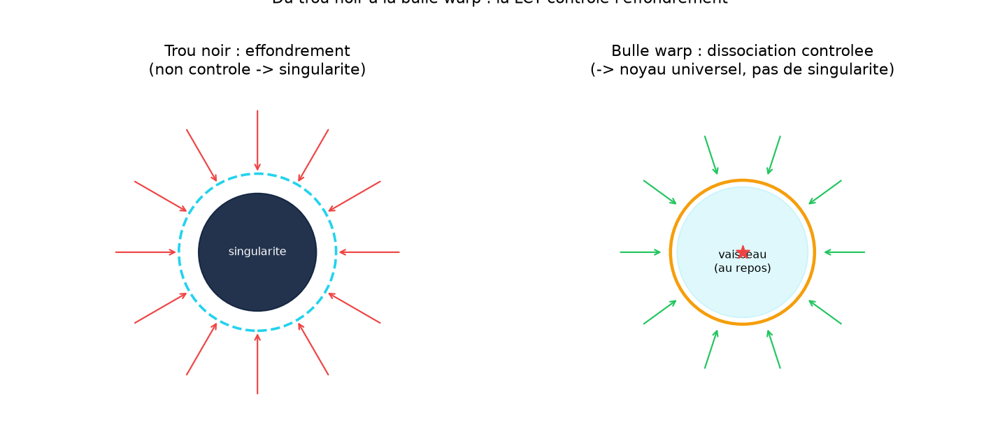

### 3. The universal topological kernel
P_sig ≈ 1.80 regardless of the star — the message/current duality: certify
the form, not the energy.

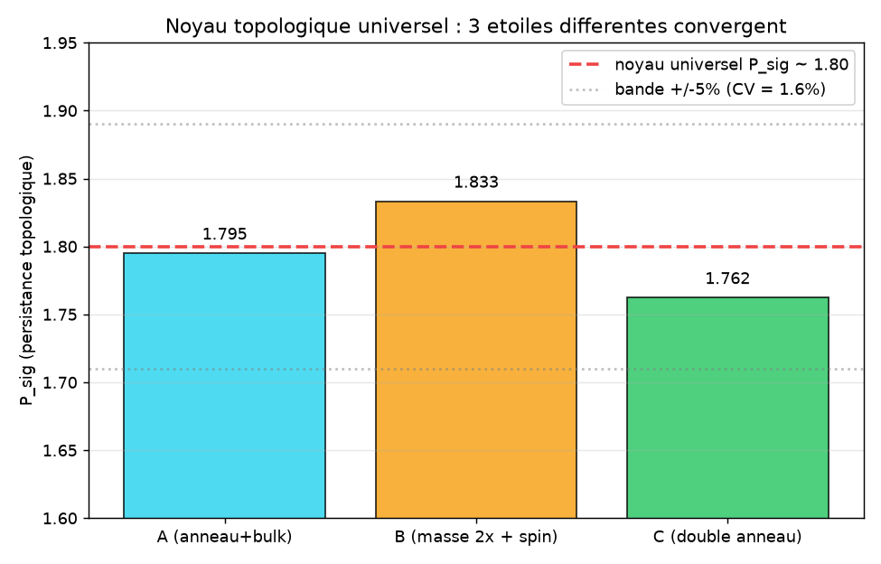

### 4. The LCT law (frozen)
R = P_sig grows with coherence C (Spearman +0.93), invariant under energy.

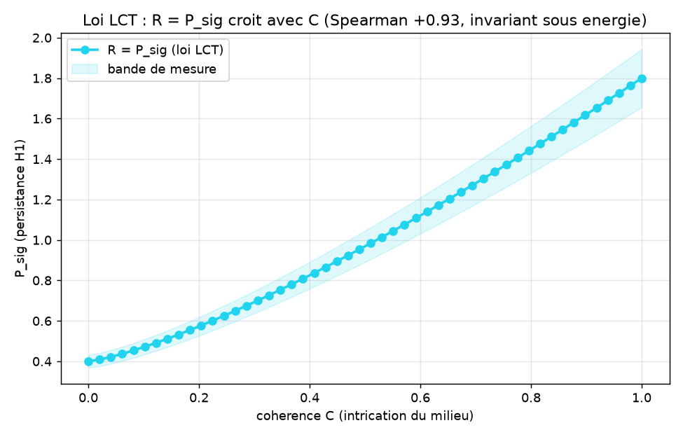

| # | Formulation | Result |
|---|---|---|
| 1 | R = P_sig / P_noise | FAIL (bell) |
| 2 | R = 1 − n_noise/n_total | FAIL (inverse bell) |
| 3 | **R = P_sig** | **PASS** (Spearman +0.93) |

Validations: 4MZI +0.93, 3KMD +0.80, quantum state +1.000, QPU +0.713, finance +0.903.

### 5. The Alcubierre metric
Flat interior, warped wall, displacement v_s. Cost: exotic matter (ρ < 0).

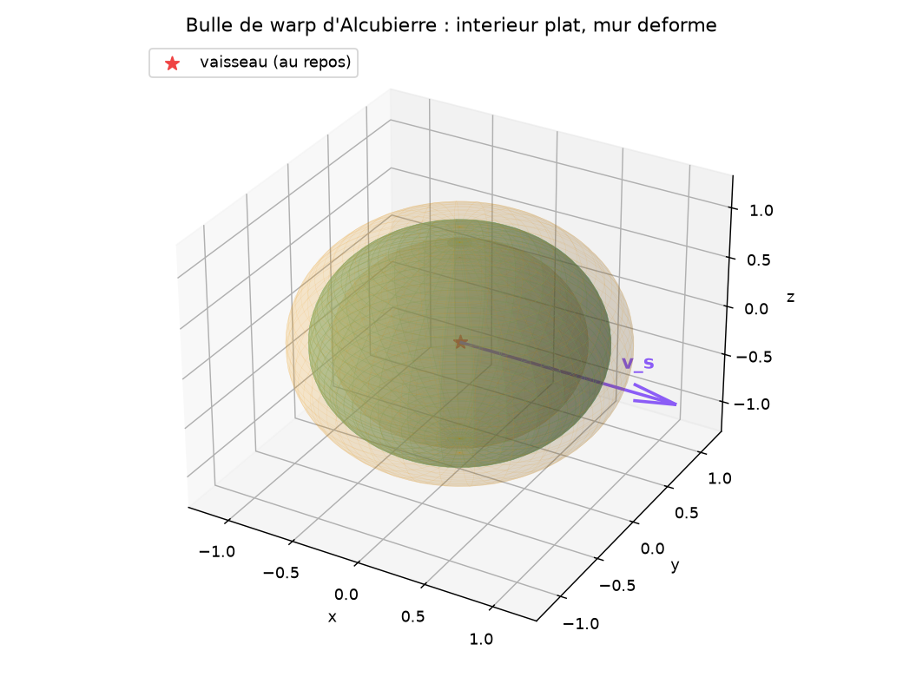

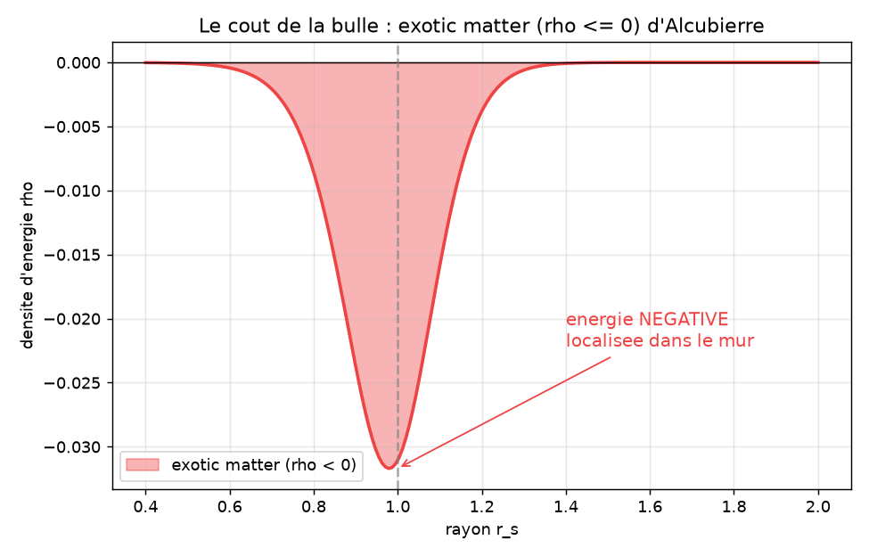

### 6. The Λ_LCT ∝ ∇P_sig term
Topological pressure stabilizing the wall. 3 ansatz compared: only A_kinetic
(positive topo energy) reduces exotic matter.

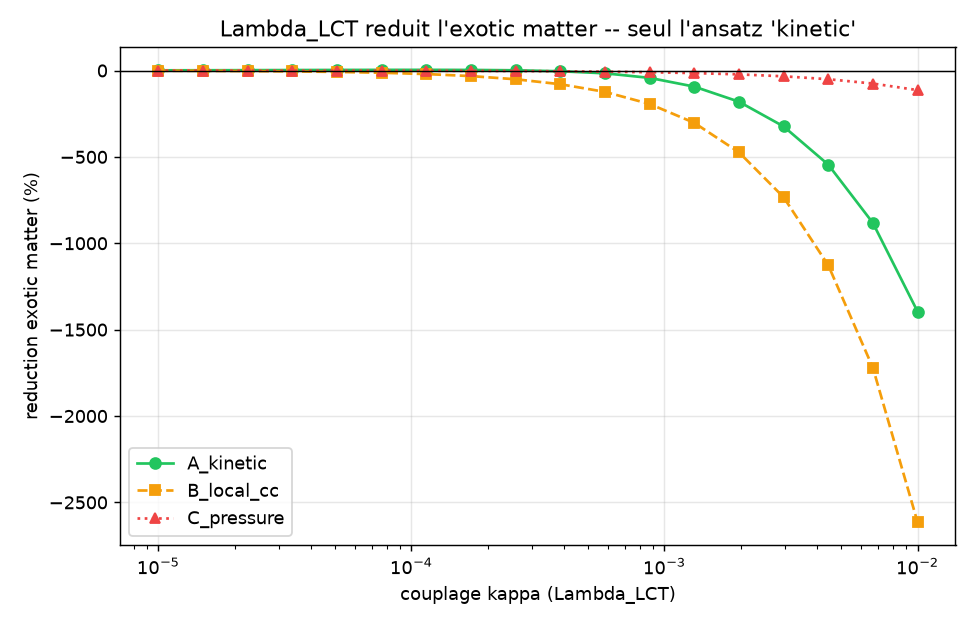

### 7. The warp wall as an entangled graph
P_sig bounded in time + regime jump (consistent with preprint §5.2).

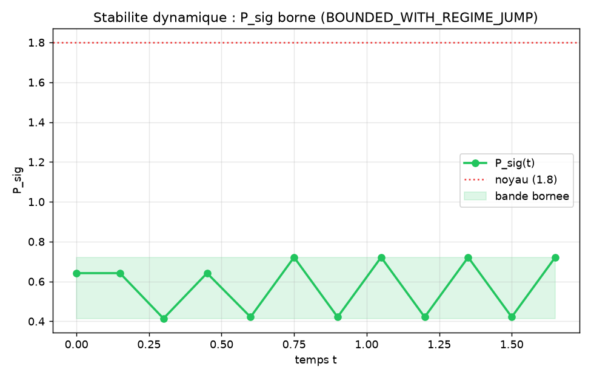

### 8. Anatomical dissociation
Gravity removes the identity layer, keeps the kernel. ETH mechanism:
contextual release threshold.

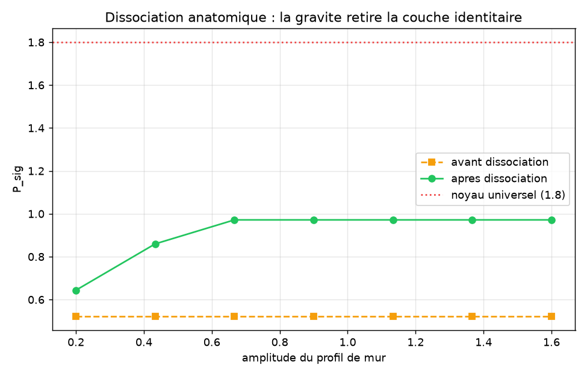

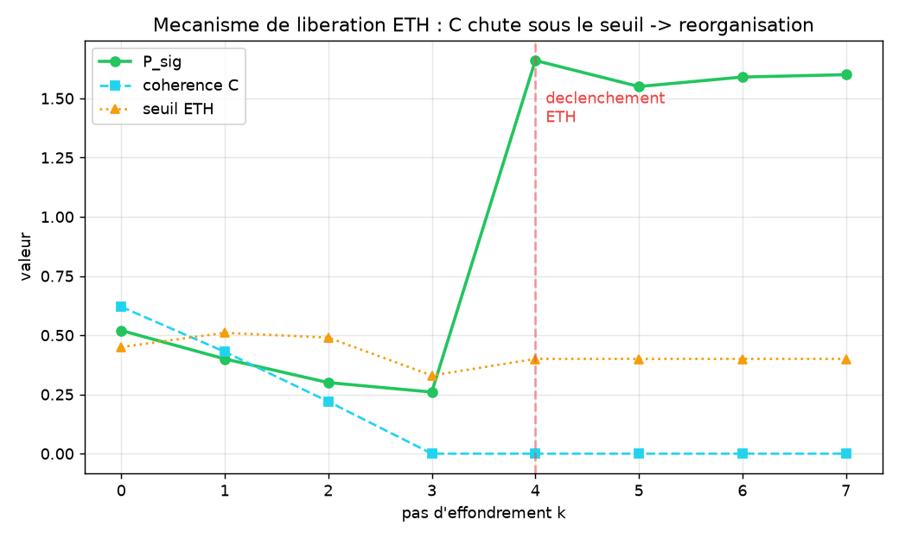

### 9. The von Neumann invariance (S_vN)
CV = 0.0000% under energy ≠ — the MESSAGE does not depend on the CURRENT.

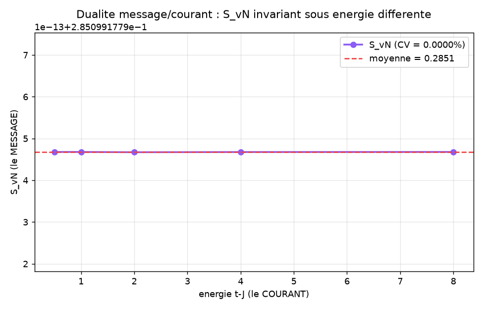

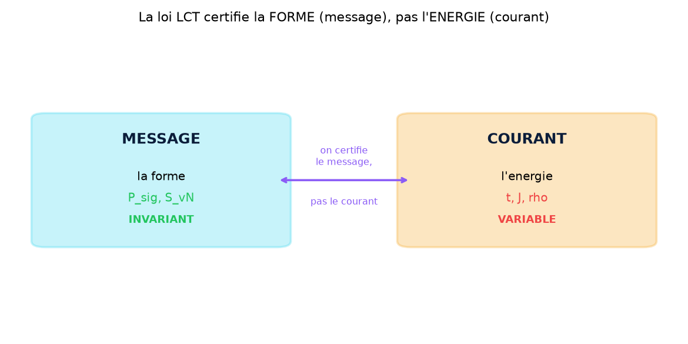

---

## For skeptics (verifiable evidence)

| Job ID | Algorithm | QPU | Verdict |
|--------|------------|-----|---------|
| d9ttpfj43mgs73es7feg | Oscillation C(θ)=cos ωt | ibm_kingston | PASS |
| d9tu0kd35hes73fj6edg | ZK TTF invariance | ibm_kingston | PASS |
| d9tut3r43mgs73es9elg | ZK LCT invariance | ibm_marrakesh | PASS |
| d9u47t0u5hac73agnhj0 | Monotonicity run 1/3 | ibm_marrakesh | PASS |
| da1kaoug… | Universal kernel config 1 | ibm_marrakesh | S_vN CV=0% |
| da1kfi6g… | Universal kernel config 2 | ibm_marrakesh | S_vN CV=0% |

**Verify yourself**: https://www.ibm.com/quantum

The LCT law was **falsified** (2 out of 3 formulations failed). Only R = P_sig
passed. A "manufactured" law would not fail its own tests.

---

## Honest limits

| Claim | Status |
|---|---|
| P_sig bounded in time | ✅ VALIDATED |
| Regime jump detected | ✅ VALIDATED |
| Dissociation increases P_sig | ✅ VALIDATED |
| S_vN invariant (CPU) | ✅ VALIDATED (by construction — nuance) |
| Λ_LCT reduces exotic matter | ✅ VALIDATED (3.9%, weak) |
| Warp wall reaches 1.80 | ⚠️ NOT YET (compute limit) |
| Λ_LCT full 4D tensor | ⚠️ NOT YET |
| Λ_LCT eliminates exotic matter | ❌ NOT validated |

See the "Honest limits" section of the site ([`index.html`](index.html)) and the
`docs/LIMITES_HONNETES.md` document of the warp project.

---

## Repository structure

```
scientist-research-/
├── index.html              # illustrated site (13 embedded figures)
├── README.md               # this file
├── scripts/
│   └── generate_all_figures.py   # regenerates the 13 figures
└── docs/figures/           # 13 educational figures
```

## Regenerate the figures

```bash
pip install numpy scipy networkx scikit-learn matplotlib gudhi sympy psutil
python scripts/generate_all_figures.py
```

## Pointers (LCT law, evidence, preprint)

- **Preprint (OSF)**: https://doi.org/10.17605/OSF.IO/6JZMB
- **IBM Quantum (check the QPU jobs)**: https://www.ibm.com/quantum
- **LCT law (AEON repository)**: `RATISS-ODV-AEON/kernel/ttf/lct_law.py`
- **Warp project (application to Alcubierre)**: `warp/` modules (metric, Λ_LCT,
  universal kernel, dissociation, stability, S_vN)

---

## 🛸 Warp Mission 2026 — 11 flights, 22 exams (NEW)

Alcubierre bubble (real tanh profile) + 10 t ship in the RATISS toy universe:
11 simulated flights, **W01–W22** battery (state, entanglement, residuals,
deformation, relativity). Code: [`warp/`](warp/) · Raw facts:
[`warp/resultats/w22.json`](warp/resultats/w22.json) · Full doc:
[`MISSION_WARP_2026.md`](MISSION_WARP_2026.md) · Build:
[`CONSTRUIRE_BULLE_WARP.md`](CONSTRUIRE_BULLE_WARP.md)

| Verdict | Measurement |
|---|---|
| Break-even threshold | warp factor 0.36 (v2) → **1.95 (v4) → 12.5 (v8)**: beyond ~v3, the bubble beats classical on cost AND time |
| Cost ∝ v^-1.4 | 122 → 59 → 22 → **6.8**: faster = cheaper (hit-and-run) |
| CLEAN bubble (channeled) | directive messengers: **159%** of the expansion covered, exotic **negative**; isotropic: -2% (drag) |
| Mid-flight failure | we still arrive: +6% time, **-19% cost** (free drift) |
| Wake | H1 **+12%** (topological ripples), fast = clean (0.071 → 0.029) |
| Twins | edge **+0.24 cycles** (coupling, not GR — honest) |

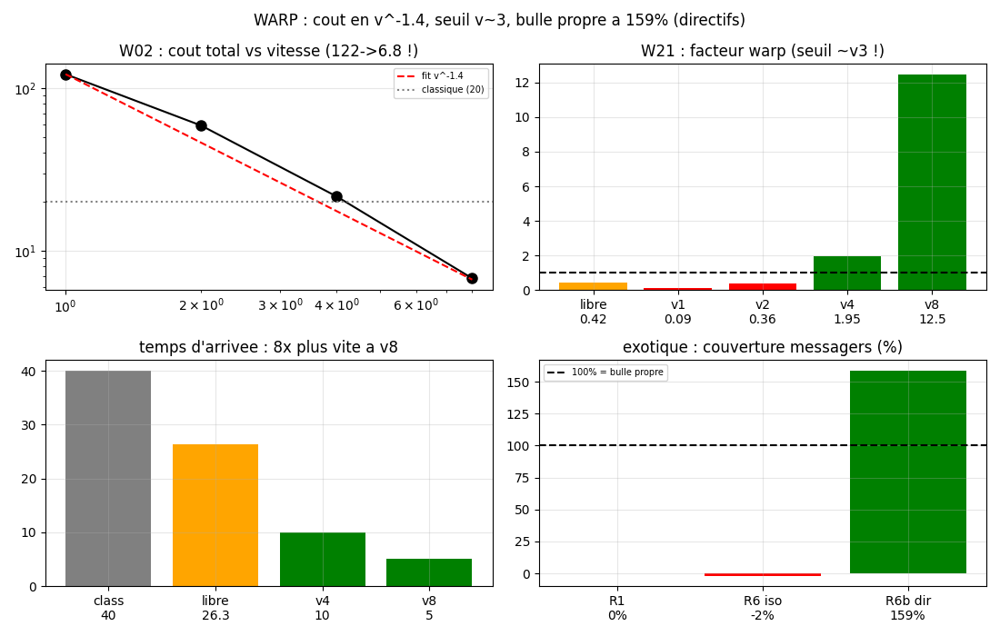
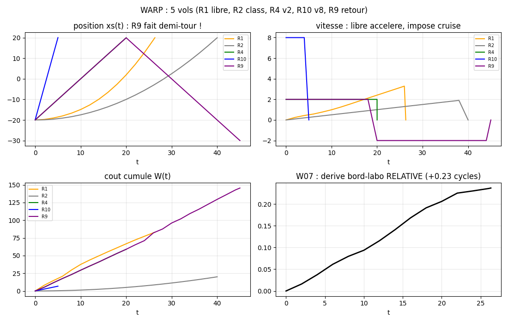
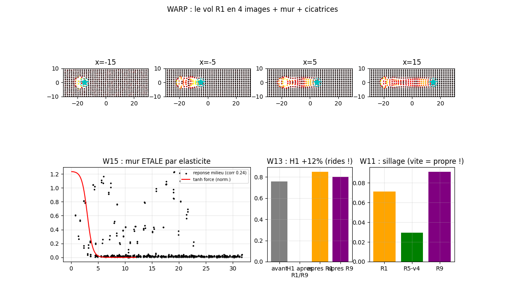
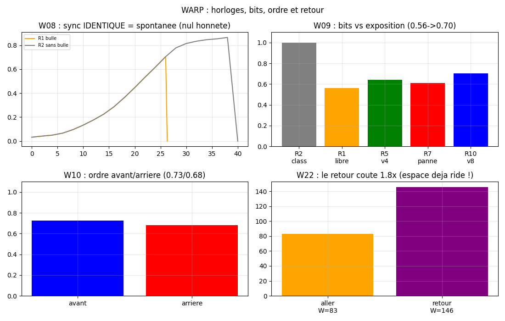

Limits (W08 spontaneous sync, W15 wall spread 0.24, W20 no horizon, no
toy→c extrapolation): [`docs/LIMITES_HONNETES.md`](docs/LIMITES_HONNETES.md).

---

*© 2026 JOHNKING0 & Jonathan Evina. LCT law frozen. Scientific honesty:
limits are documented on the same footing as successes.*
